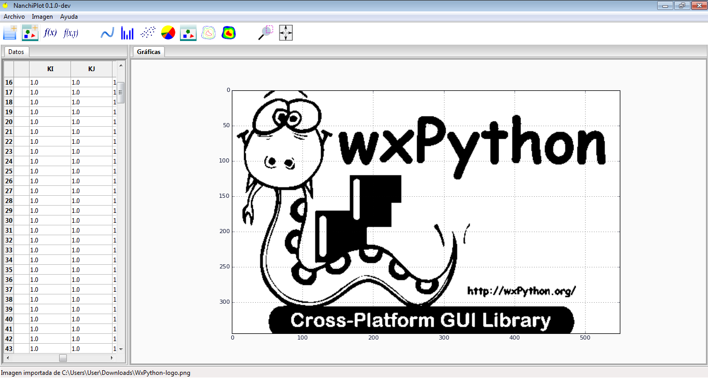
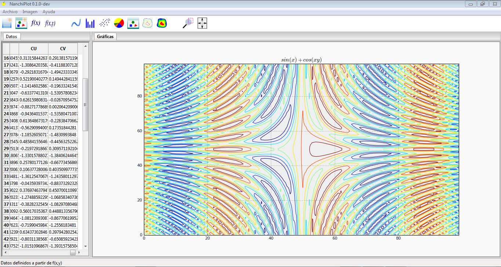

# NanchiPlot

## ¿Qué es NanchiPlot?


NanchiPlot está pensado como un software de graficado a partir de un conjunto de valores numéricos definidos 
en una grilla/malla, los cuales pueden representar pares de coordenadas (x,y), una lista de cantidades 
cualesquiera, intensidades de pixeles para imagenes en escala de grises, o cualquier otro tipo arreglo de datos que 
el usuario importe o ingrese en las celdas destinadas para tal propósito.

Para definir los arreglos de datos el usuario puede importarlos desde un fichero de datos (ASCII), crearlos 
a partir de una función f(x) o bien importar una imagen.

Las opciones de graficado disponibles son:

* Gráficas de líneas (Coordenadas Rectangulares)
* Gráficas de puntos (Scatter Plot)
* Gráficas de barras
* Gráficas de pastel
* Representación de imágenes
* Gráficas de contorno (curvas de nivel)

Algunas de las capacidades de NanchiPlot se enlistan a continuación:

* Importar datos de ficheros de texto plano.
* Importar datos de archivos CSV.
* Importar imágenes como datos (MxN: imágenes en escala de grises).
* Operaciones básicas con imágenes (binarización, filtros).
* Crear datos a partir de funciones de una y dos variables.
* Personalizar estilos, grosores y colores de líneas
* Personalizar estilos, grosores y colores de rejillas
* Personalizar el color de fondo (axes)
* Insertar textos/anotaciones
* Mover líneas de manera interactiva
* Mover textos de manera interactiva


## Requerimientos

* wxPython
* Matplotlib
* NumPy
* Scikit-image (optional for image processing operations)

## Instalación

Situese en el directorio de su preferencia y cree una carpeta `NanchiPlot`

```
mkdir NanchiPlot
cd NanchiPlot
```

Dentro de este directorio, clone el repositorio desde:

```
git clone https://github.com/JorgeDeLosSantos/NanchiPlot.git
```

Finalmente ejecute el archivo `NanchiPlot.py`

```
NOTA: 

Esta versión de desarrollo no dispone de un procedimiento que instale el código 
como cualquier otra librería de Python. En las versiones liberadas se introducirá 
un script que permita a NanchiPlot ser ejecutado desde la consola (vía scripts de Python: /PYTHON_DIR/Scripts/NanchiPlot.py).
```

## Documentación 

La documentación está en desarrollo. Puede compilar la documentación disponible (docs/_source/) utilizando *Sphinx*.


## Versión:
 
Actualmente en fase de desarrollo inicial. **(0.1.0)-dev**

## Screenshots






## Más información

```
Desarrollador: Pedro Jorge De Los Santos
E-mail: delossantosmfq@gmail.com
```
