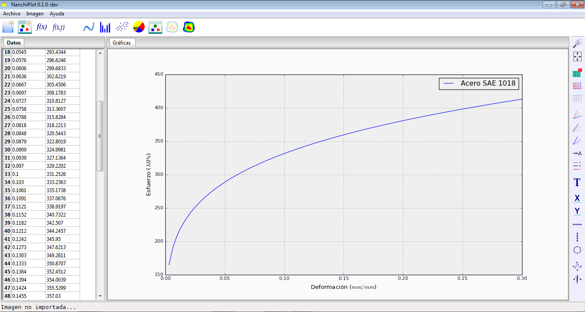
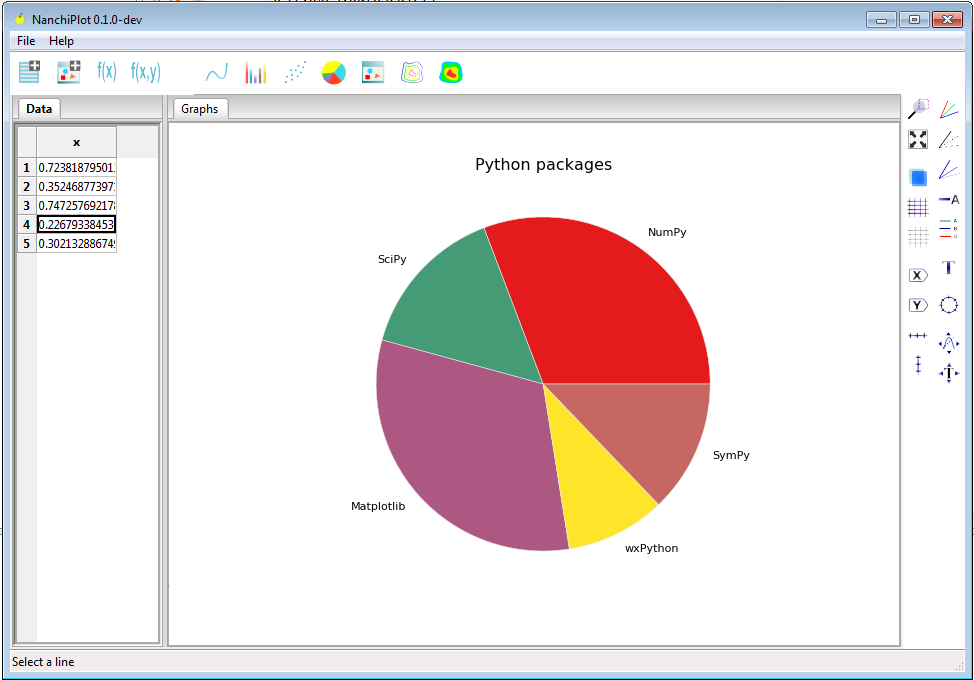
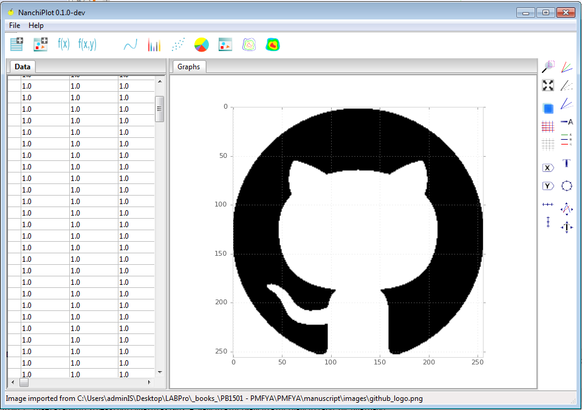
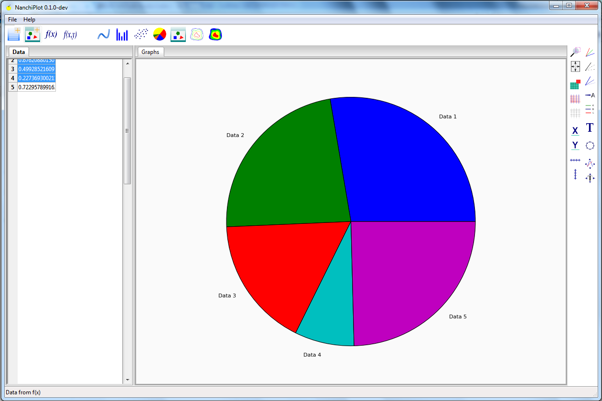

# NanchiPlot

## Features


Plot types:

* Line plot
* Scatter plot
* Bar plot
* Pie plot
* Images 
* Contour graphs

Capabilities:

* Import data from plain text files. 
* Import data from CSV files.
* Import images as data (grayscale only).
* Create data from f(x) and f(x,y) functions.
* Custom styles, colors and width of lines.
* Custom styles, colors and width of grids.
* Custom background color of Axes.
* Insert text/annotations.
* Move lines interactively.
* Move texts interactively.

## Requirements

* wxPython
* Matplotlib
* NumPy

## Installation

Currently this is not a PyPI library, then to install, clone this repository:

```
git clone https://github.com/JorgeDeLosSantos/NanchiPlot.git
```

and install with:

```
python setup.py install
```

Or using `pip`:

```
python setup.py sdist
cd dist
pip install nanchi-0.1.0.zip
```

## Documentation

Build the documentation using Sphinx. Currently in write process.

## Version
 
In development: **0.1.0-dev**

## Screenshots







## More info

```
Developer: Pedro Jorge De Los Santos
E-mail: delossantosmfq@gmail.com
```
